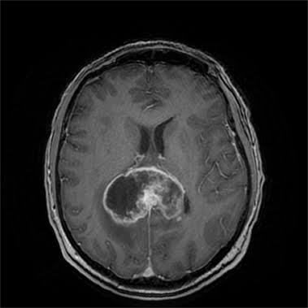
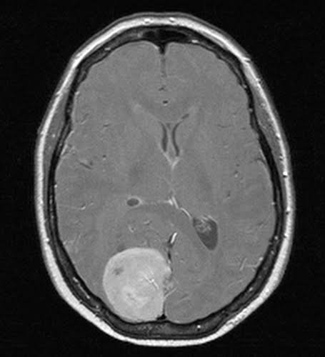
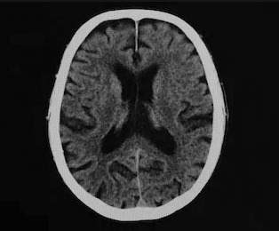
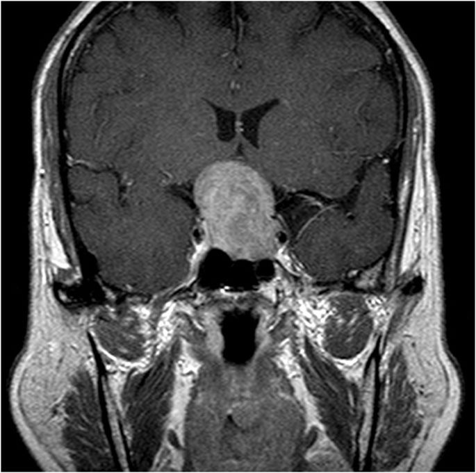
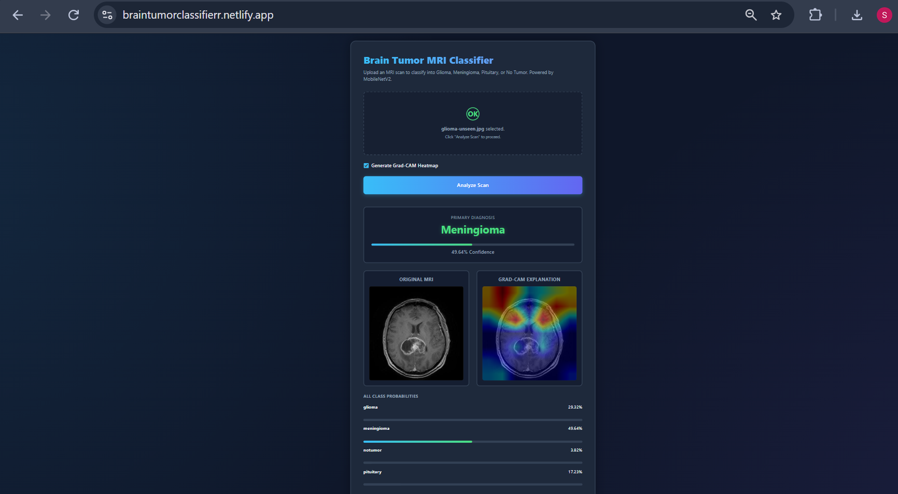
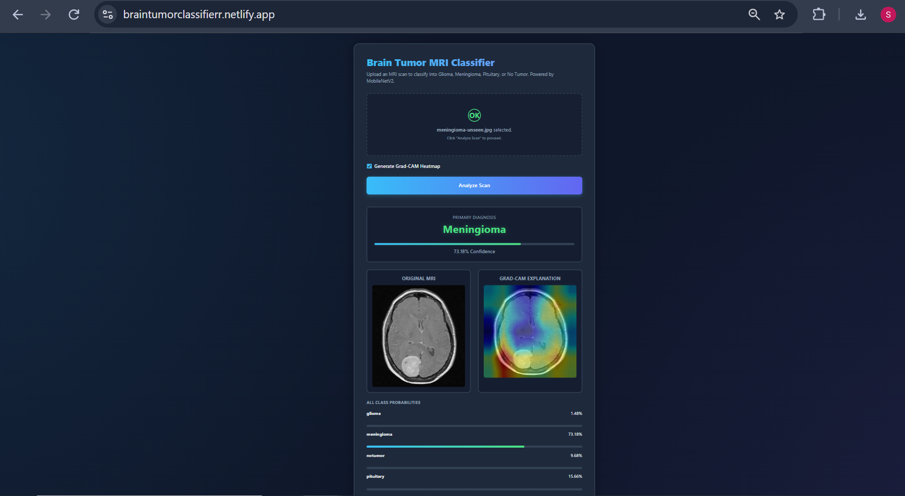
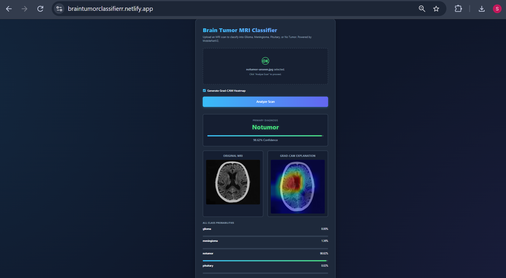
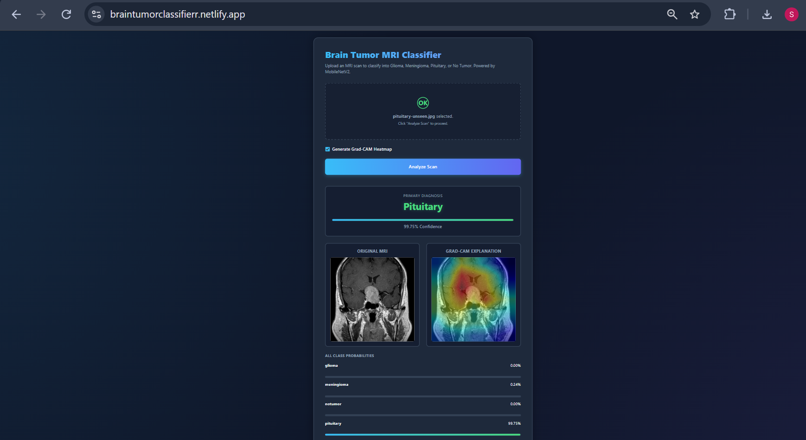

## Evaluation on Unseen External Data

To truly validate the model's generalization capabilities, I tested the deployed API on a completely unseen dataset sourced from an external repository (Kaggle: Brain Tumor Classification MRI by Sartaj Bhuvaji), entirely separate from our training and testing splits.

I evaluated the deployed model on completely unseen external MRI images, successfully achieving a **3/4 accuracy rate (75%)** by correctly predicting the **meningioma, no-tumor, and pituitary** scans. However, it misclassified the **glioma** scan, predicting **meningioma with 49.64% confidence** over **glioma at 29.32%**.

### Unseen External Images

  
  
  
  

### Prediction Results

  

  

  

  

